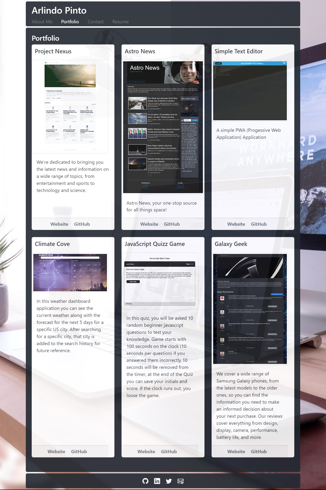

# REACT SINGLE PAGE PORTFOLIO
Single Page Portfolio using React where you can showcase some of your projects and publish a resume about your skillsets. 

[](https://opensource.org/licenses/MIT)

## Installation
To install this project, clone the repository to your local machine and run the following commands:

``` 
npm install
```
## Usage
To start the server, run the following command:
``` 
npm start
```
This will start the server on http://localhost:3000.

## Website Link
https://arlindo2017.github.io/react-single-page-portfolio/

## Website Screenshot

Single Page Portfolio


## Skills on display
- React
- Bootstrap
- Custom CSS Styles in javascript

